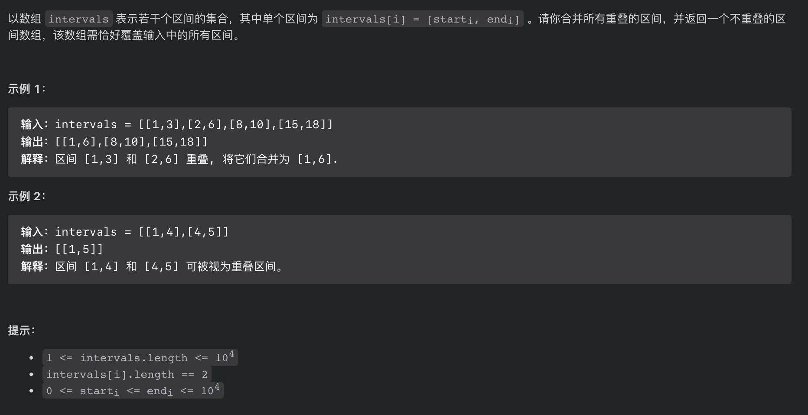

## 解法

### 方法 1:贪心算法 寻找局部最优解

```js
/**
 * @param {number[][]} intervals
 * @return {number[][]}
 */
var merge = function (intervals) {
  let res = [];
  // 如果传递进来的数组长度为0 返回一个空数组
  if (intervals.length === 0) {
    return [];
  }
  intervals.sort((a, b) => a[0] - b[0]);
  // 结果数组放进第一个数组
  res.push(intervals[0]);
  for (let i = 1; i < intervals.length; i++) {
    //如果当前区间的左端点 大于  合并数组的最后一个区间的右端点，可以直接加入
    if (intervals[i][0] > res[res.length - 1][1]) {
      res.push(intervals[i]);
    } else {
      //如果当前区间的右端点 大于  合并数组的最后一个区间的右端点
      if (intervals[i][1] > res[res.length - 1][1]) {
        //最后一对换区间
        res[res.length - 1] = [res[res.length - 1][0], intervals[i][1]];
      }
    }
  }
  return res;
};
```

### 方法 2
